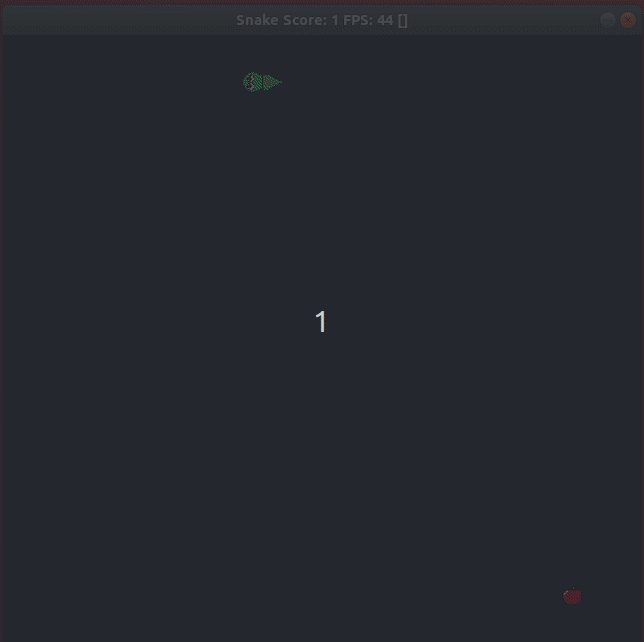

#  Snake Game

## Project description
This game is called Snake Game. The goal is to guide the snake to eat the apple. Use direction buttons to set the direction (left, right, up, down) the snake is going to. Each time the snake eats the food his body grows up and score is incremented. If the snake eats his own body the game ends.
The sample code can be found at the repo [Udacity C++ Nanodegree Program](https://www.udacity.com/course/c-plus-plus-nanodegree--nd213).

## Rubric points addressed

### Memory Management
* The project makes use of references in function declarations
  * files: renderer.h (lines 14, 17); renderer.cpp (lines 42, 80)
* The project uses destructors appropriately
  * files: renderer.cpp (line 38)

## Structure and output of the program

## Dependencies for Running Locally
* cmake >= 3.7
  * All OSes: [click here for installation instructions](https://cmake.org/install/)
* make >= 4.1 (Linux, Mac), 3.81 (Windows)
  * Linux: make is installed by default on most Linux distros
  * Mac: [install Xcode command line tools to get make](https://developer.apple.com/xcode/features/)
  * Windows: [Click here for installation instructions](http://gnuwin32.sourceforge.net/packages/make.htm)
* SDL2 >= 2.0
  * All installation instructions can be found [here](https://wiki.libsdl.org/Installation)
  * Note that for Linux, an `apt` or `apt-get` installation is preferred to building from source.
* gcc/g++ >= 5.4
  * Linux: gcc / g++ is installed by default on most Linux distros
  * Mac: same deal as make - [install Xcode command line tools](https://developer.apple.com/xcode/features/)
  * Windows: recommend using [MinGW](http://www.mingw.org/)

## Basic Build Instructions

1. Clone this repo.
2. Make a build directory in the top level directory: `mkdir build && cd build`
3. Compile: `cmake .. && make`
4. Run it: `./SnakeGame`.
